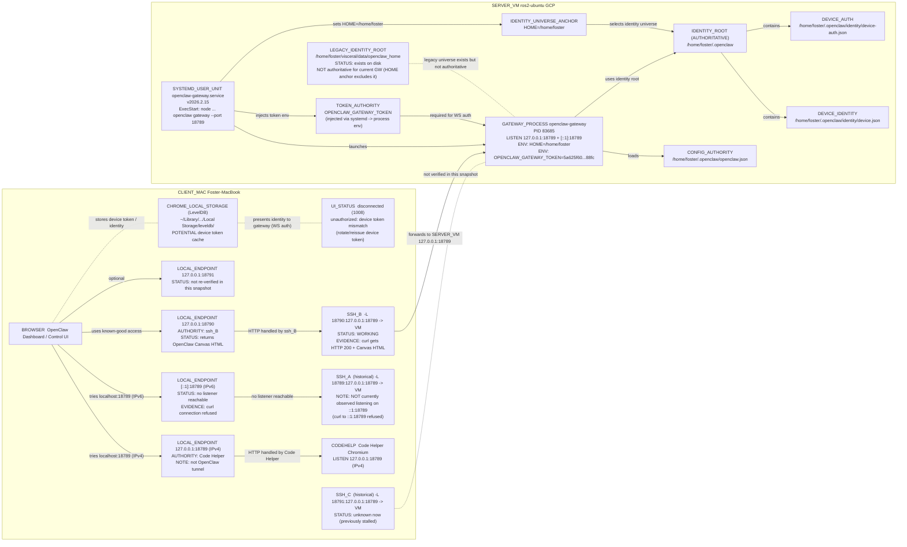
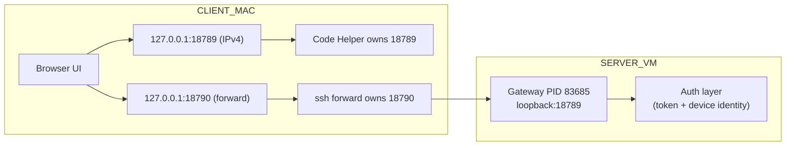
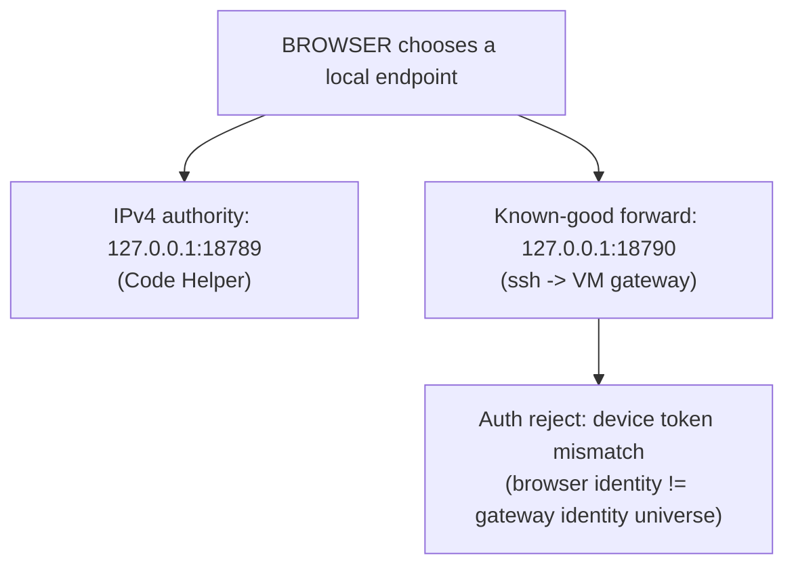

# VISCERAL Runtime Authority Graph — Most‑True Topology Artifact (as of 2026‑02‑19)

**Purpose:**  
This document captures the authoritative runtime topology of the OpenClaw gateway deployment and the client‑side SSH forwarding environment.  
It explicitly identifies authority bindings, ambiguous authorities, and verified client‑side identity storage locations.

**Key update vs prior versions:**  
- **Gateway identity universe is proven** by the running gateway process environment: `HOME=/home/foster` ⇒ **identity root = `/home/foster/.openclaw`**.  
- **Client transport has shifted:** `127.0.0.1:18790` now returns `HTTP/1.1 200 OK` from the gateway canvas endpoint.  
- **IPv6 local listener on `::1:18789` is not currently reachable** (`Connection refused`), and `lsof` now shows **only Code Helper listening on IPv4 `127.0.0.1:18789`**.  
- **UI reports:** `disconnected (1008): unauthorized: device token mismatch (rotate/reissue device token)` — pointing to a **client identity mismatch** rather than transport failure.

---

## Verified Evidence Summary (high signal)

### SERVER_VM (ros2-ubuntu)
- Gateway process **PID 83685** listens on **loopback 18789** (v4 + v6) (previous evidence via `ss -lntp`).
- Gateway process environment (authoritative):
  - `HOME=/home/foster`
  - `OPENCLAW_GATEWAY_PORT=18789`
  - `OPENCLAW_GATEWAY_TOKEN=5a625f60...88fc`
  - `OPENCLAW_SERVICE_KIND=gateway`
  - `OPENCLAW_SERVICE_VERSION=2026.2.15`

**Consequence (authority binding):**  
`HOME=/home/foster` anchors OpenClaw’s runtime identity/config universe to:
- **IDENTITY_ROOT = `/home/foster/.openclaw`**  
and not any legacy directory.

### CLIENT_MAC (Foster-MacBook)
- `lsof -nP -iTCP:18789 -sTCP:LISTEN` now shows:
  - **Code Helper** listening on **IPv4 `127.0.0.1:18789`**
  - **no ssh listener** on that port at this moment
- `curl "http://[::1]:18789/__openclaw__/canvas/"` ⇒ **connection refused** (no IPv6 local listener)
- `curl http://127.0.0.1:18790/__openclaw__/canvas/` ⇒ **HTTP 200 OK** and returns Canvas HTML (5731 bytes)

### Client identity storage location (Chrome)
- Chrome Local Storage LevelDB directory exists at:
  - `~/Library/Application Support/Google/Chrome/Default/Local Storage/leveldb/`
  - contains many `*.ldb` files (evidence: directory listing)

**Consequence:**  
The browser’s device token / identity is *plausibly stored* in this Local Storage DB (exact key/value not yet extracted in this artifact).

---

# Diagram A — Detailed Runtime Reality (Full Fidelity)

---

# Diagram A (Condensed Transport + Auth View)

---

# Diagram B — Minimal Authority Split Mechanism (Why “split reality” persists)

---

## Authority Conclusions (Current Snapshot)

### Server (canonical)
- **Gateway authority:** `openclaw-gateway` process **PID 83685**, systemd‑launched, loopback‑bound on `:18789`.
- **Token authority:** `OPENCLAW_GATEWAY_TOKEN=5a625f60...88fc` injected into the gateway process environment.
- **Identity authority:** **`/home/foster/.openclaw`**, proven by gateway process env `HOME=/home/foster`.

### Client (canonical access path)
- **Do not use** `127.0.0.1:18789` (IPv4) — currently owned by Code Helper.
- **Use** `127.0.0.1:18790` — proven to return gateway Canvas HTML over the SSH forward.

### Current failure class
- Transport is now good (at least via `18790`).
- Failure is now **authorization/identity mismatch**:
  - `unauthorized: device token mismatch (rotate/reissue device token)`
  - Likely involves stale browser identity cached in Chrome Local Storage vs gateway identity store under `/home/foster/.openclaw`.

---

## What remains to complete the graph for a handoff engineer
(These are *diagnosis targets*, not actions in this artifact.)

1) **Client identity binding**
- Identify the exact key(s) in Chrome Local Storage that store the OpenClaw device token / client id.
- Confirm what value is presented during WS auth.

2) **Server expected device roster**
- Enumerate the gateway’s paired/expected devices under `/home/foster/.openclaw` (exact file(s) / schema).
- Confirm mismatch is between browser token and server expected token.

3) **Reconciliation mechanism**
- Determine the canonical, supported way to rotate/reissue device token (UI or CLI), and whether it is server-side, client-side, or both.

---

# End of Document
