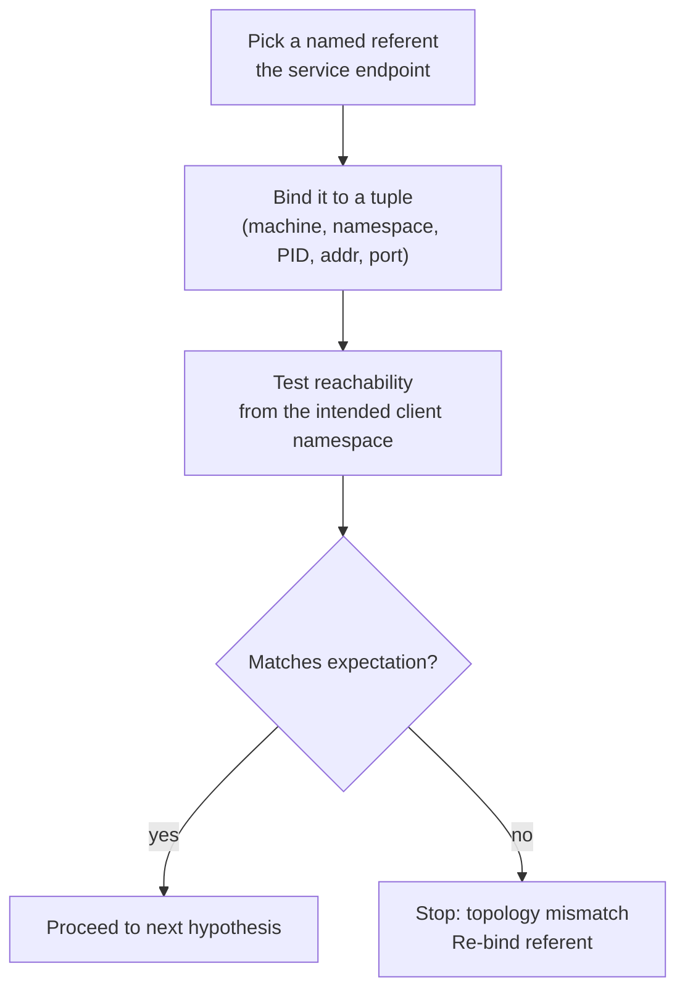
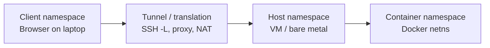
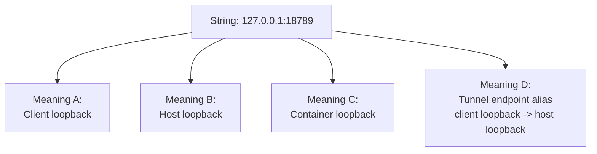
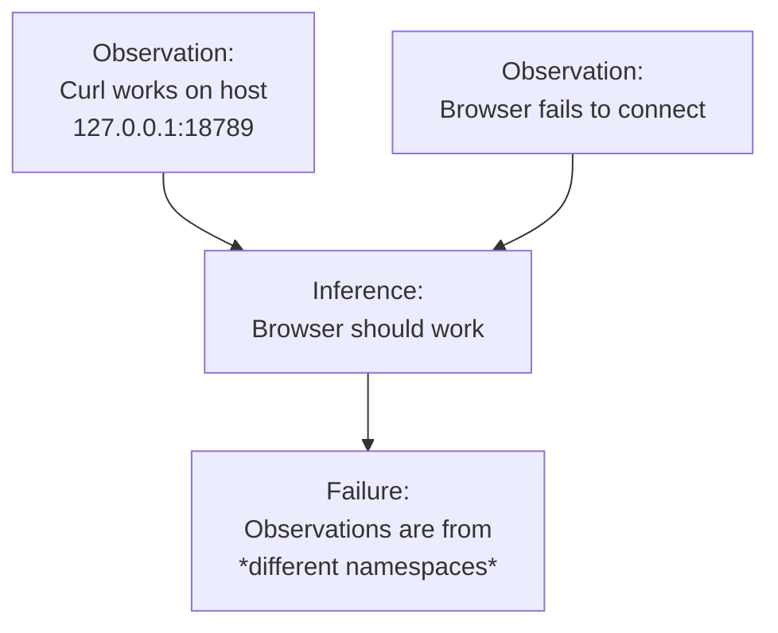
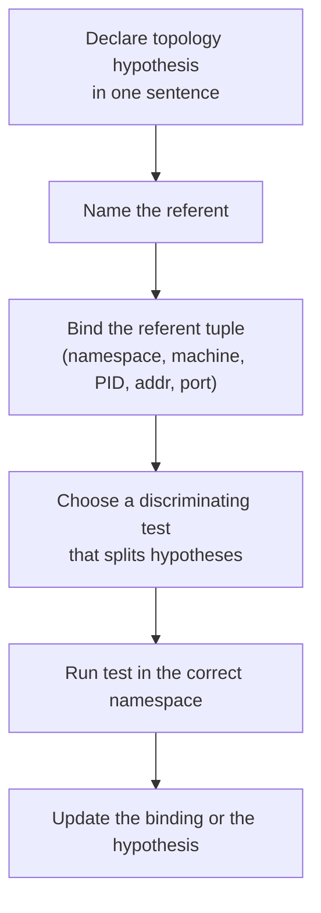

# Architectural Note: Epistemic Control Failure Under Distributed Topology Ambiguity

**Purpose:** Describe, at a systems-architecture level, why debugging
(and even basic reasoning) fails when a system spans multiple namespaces
and the engineer does not explicitly bind symbolic references ("the
server", "the gateway", "localhost") to concrete referents (machine,
process, port, namespace).

This is **not project-specific**. It is a general pattern in modern
networking + containerized development.

------------------------------------------------------------------------

## 1. The core phenomenon

### Definition: Epistemic control failure

An **epistemic control failure** occurs when an engineer cannot reliably
answer:

-   *What am I talking about?* (Which concrete thing does a name refer
    to?)
-   *Where am I executing?* (Which machine / namespace is producing this
    output?)
-   *What path connects X to Y?* (Which network edges actually exist?)

When those are unstable, engineering becomes "locally coherent but
globally false":

-   Every step *sounds* right in isolation.
-   But each step may apply to a different namespace than the one
    actually in play.

### Definition: Distributed topology ambiguity

A system has **distributed topology ambiguity** when multiple valid
connection topologies are possible given the same human-language
description (e.g., "open the dashboard at localhost") and nothing in the
current evidence pins down which topology is real.

------------------------------------------------------------------------

## 2. Why this happens: the four-namespace trap

Many modern setups implicitly involve **four** distinct namespaces:

1.  **Host namespace** (e.g., a VM in the cloud):\
    Processes, ports, firewall rules, interfaces, routing tables,
    filesystem.

2.  **Container namespace** (e.g., Docker):\
    Its own process tree, network namespace, loopback, interfaces, DNS,
    sometimes its own firewall layer.

3.  **Client namespace** (e.g., your laptop browser):\
    Where "the page" is rendered; where DNS resolves; where WebSockets
    originate; where localStorage lives.

4.  **Tunnel / translation layer** (SSH `-L`, reverse proxy, load
    balancer, NAT, port-forward):\
    A *mapping* between namespaces that makes "localhost" or a port
    number *mean something different* depending on where it is spoken.

If these namespaces are not explicitly discriminated, the same token
string---`127.0.0.1:18789`---can refer to **different machines** and
**different processes**.

------------------------------------------------------------------------

## 3. The key collision: "localhost" is not a place

### "localhost" is a *relative reference*

`localhost` / `127.0.0.1` is **always** "this machine", but "this
machine" depends on:

-   Where the client is running (browser vs curl)
-   Whether a tunnel is active
-   Whether container networking is bridged or host-mode
-   Whether a reverse proxy rewrites destinations

So the statement:

> "The service is on localhost:18789."

is incomplete unless it also specifies:

-   *Which namespace* "localhost" refers to
-   *Which process* is listening there
-   *Which path* a remote client uses to reach it

------------------------------------------------------------------------

## 4. Namespaces in standard networking terms

### 4.1 Process namespace

-   A port is "owned" by a process.
-   The question "what is listening on port 18789?" is meaningless
    without "in which namespace?"

### 4.2 Network namespace (Linux / containers)

A network namespace includes: - its own `lo` interface - its own IP
addresses - its own routing tables - its own bound sockets

Containers often run in their own network namespaces. That means: -
container `127.0.0.1` is *not* host `127.0.0.1` - `0.0.0.0:18789` inside
container is "all container interfaces", not the host's

### 4.3 NAT / port publishing (Docker bridge)

Docker bridge mode typically works like:

-   Container listens on `0.0.0.0:PORT` **inside container**
-   Docker publishes host `HOSTPORT -> container PORT`
-   External clients hit host IP + HOSTPORT

If publishing is missing, the service may be "up" but unreachable from
outside the container network.

### 4.4 Tunnel / port-forward layer

SSH local forwarding:

-   Client machine listens on `127.0.0.1:LOCALPORT`
-   Traffic is forwarded over SSH
-   Remote side connects to `REMOTEHOST:REMOTEPORT` (often remote
    loopback)

This makes "localhost" on the client *alias* remote loopback.

------------------------------------------------------------------------

## 5. The failure loop mechanism

The loop typically looks like this:

1.  Engineer observes a symptom in one namespace (e.g., browser can't
    connect).
2.  Engineer runs a check in a different namespace (e.g., curl inside
    host).
3.  Engineer draws a conclusion assuming both observations refer to the
    same endpoint.
4.  Engineer "fixes" something real---but in the wrong namespace.
5.  Symptom persists; confusion increases; more speculative branches
    open.

### The crucial missing step

The missing step is **referent binding**:

> Bind every symbolic object ("the gateway", "the dashboard") to a
> unique tuple:\
> **(namespace, machine, process, address, port, protocol).**

Without that, "the gateway is running" is not operationally meaningful.

------------------------------------------------------------------------

## 6. Clean control-flow diagrams

These are intentionally **simple** and **not crammed**.

### 6.1 Healthy mental model: explicit topology binding

### 6.2 Four namespaces as first-class nodes

### 6.3 "localhost" ambiguity (same string, different referents)

### 6.4 The common "two truths, one false inference" trap

------------------------------------------------------------------------

## 7. Practical taxonomy of "what to name"

When debugging distributed topology, you must name:

### 7.1 The server referent

-   machine identity (public IP / hostname)
-   execution context (host vs container)
-   process identity (PID / command line)
-   bind address (`127.0.0.1` vs `0.0.0.0` vs specific interface IP)
-   protocol (HTTP vs WS vs WSS)
-   auth mechanism (token, header, query param)

### 7.2 The client referent

-   which machine runs the client (laptop vs remote desktop vs VM
    browser)
-   which app (browser vs curl vs SDK)
-   which URL is typed (and whether a proxy/tunnel rewrites it)

### 7.3 The translation referent

-   what is forwarding (ssh -L, reverse proxy, load balancer)
-   what maps to what: `client:LOCALPORT -> host:REMOTEPORT`
-   whether it terminates TLS / rewrites headers

------------------------------------------------------------------------

## 8. Why engineers drift into epistemic control failure

Common drivers:

-   **Tool asymmetry:** logs are on the server; symptoms are on the
    client.
-   **Name overload:** "gateway", "dashboard", "server", "container" are
    used interchangeably.
-   **Invisible layers:** NAT, ssh tunnels, browser caching, service
    workers, proxies.
-   **Local correctness bias:** each command output is true *somewhere*,
    so it feels like progress.
-   **Branch explosion:** once confused, humans and LLMs generate
    "plausible next steps" instead of forcing discriminating tests.

------------------------------------------------------------------------

## 9. Architectural countermeasure: referent binding protocol

A high-level protocol that prevents this class of failure:

Key principle:

> **No conclusion without a bound referent.**\
> If you cannot point to the process and socket, you do not "know" where
> the service is.

------------------------------------------------------------------------

## 10. Relationship to standard networking practice

This is the same discipline used implicitly by experienced network
engineers:

-   They always ask: "From where are you testing?" and "To where are you
    connecting?"
-   They distinguish **bind** (server-side) from **reachability**
    (path + firewall) from **authorization** (app-layer).
-   They treat NAT, tunnels, and proxies as explicit components of the
    topology---not "magic".

Containerized development and modern cloud infrastructure make these
layers ubiquitous, which is why the failure mode is increasingly common.

------------------------------------------------------------------------

## 11. Summary: the architectural moral

Distributed debugging requires an **architecture of knowledge**:

-   Names must be bound to concrete referents.
-   Namespace boundaries must be explicit.
-   The path between client and server must be treated as a real object.
-   Discriminating tests must be preferred over narrative plausibility.

If you don't do this, you get **referential split-brain**: multiple
realities, one vocabulary, and endless failure loops.
